# 🍴 **Food Explorer**

<p align="center">
  <a href="#project">📄 Projeto</a> •
  <a href="#pages">📑 Páginas</a> •
  <a href="#features">⚙️ Funcionalidades</a> •
  <a href="#technologies">🛠️ Tecnologias</a> •
  <a href="#usage">🚀 Executar</a> •
  <a href="#users">👥 Users</a>
</p>

---

## 📄 Projeto

O **Food Explorer** é uma aplicação de cardápio digital, desenvolvida como o desafio final do curso **Explorer** da Rocketseat.
O objetivo do projeto é a criação de uma plataforma em que os usuários clientes possam filtrar e visualizar detalhes de pratos de um restaurante para realizar pedidos, enquanto os usuários administradores têm a capacidade de gerenciar o cardápio, podendo criar novos pratos, edita-los e excluí-los.

Este é o repositório do front-end do projeto, o repositório do **back-end** está disponível [aqui](https://github.com/larissamateini/api-foodexplorer).

🔗 **Acesse a aplicação aqui**:  
[App Food Explorer](https://menu-food-explorer.netlify.app/)

---

## 📑 Páginas

### 1. **SignIn**: Página de login

<p align="center">
  
  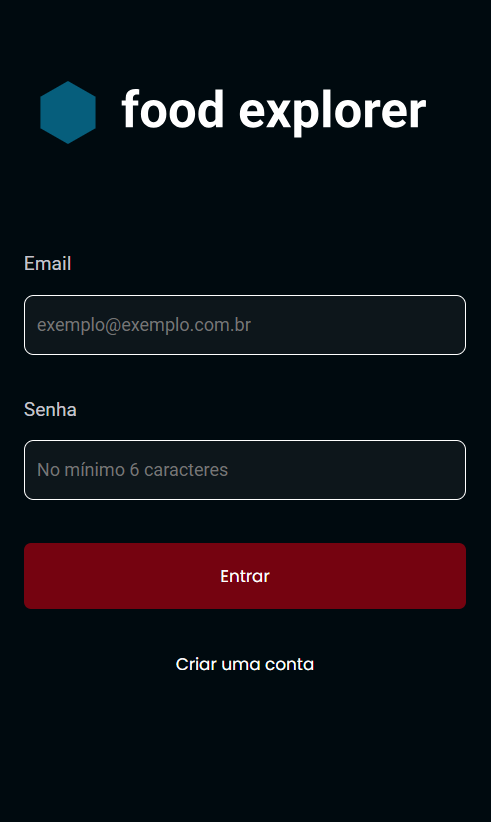
</p>

### 2. **SignUp**: Página de cadastro

<p align="center">
  
  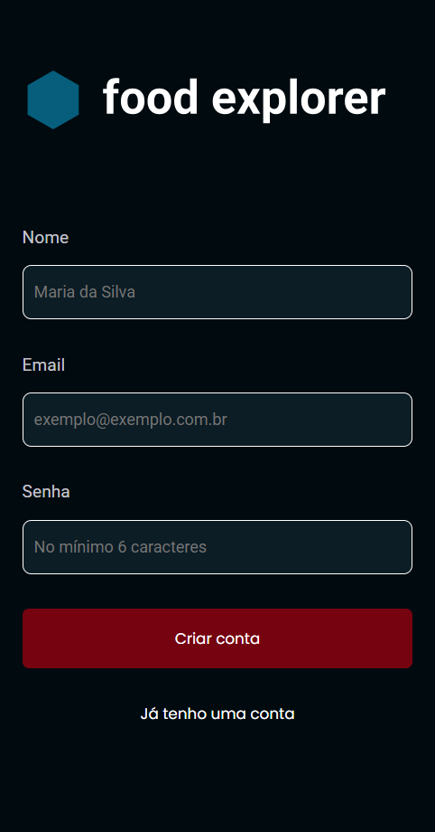
</p>

### 3. **Homepage**: Página inicial com os pratos disponíveis

#### User

<p align="center">
  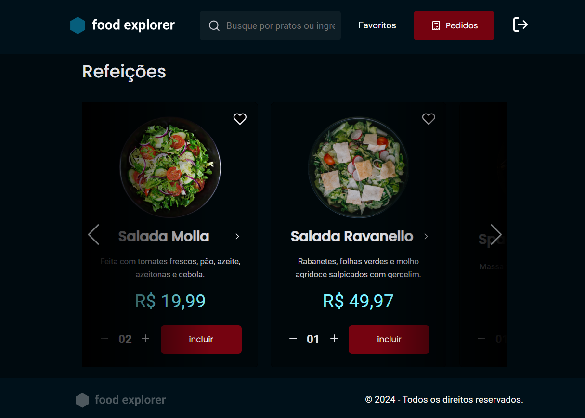
  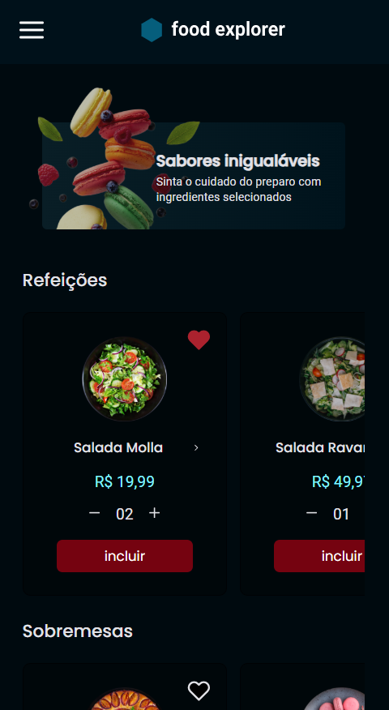
</p>

#### Admin

<p align="center">
  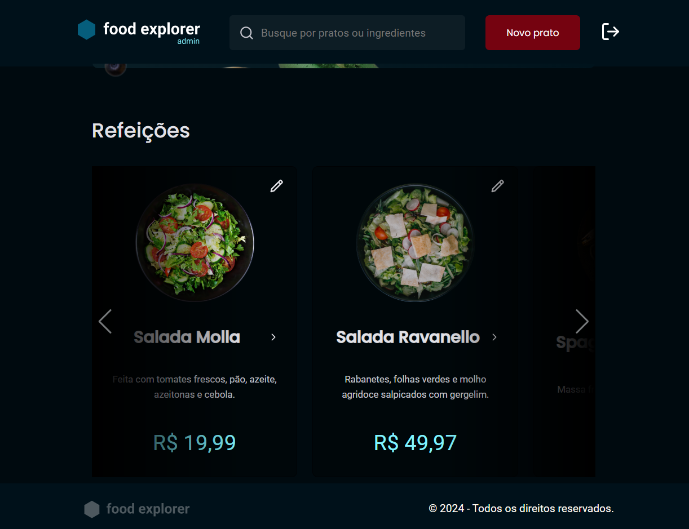
  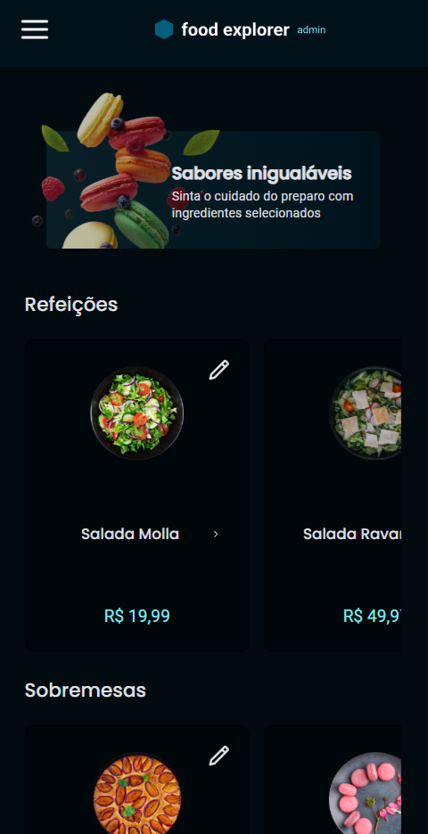
</p>

### 4. **Adicionar prato**: Página com formulário para adicionar novos pratos

<p align="center">
  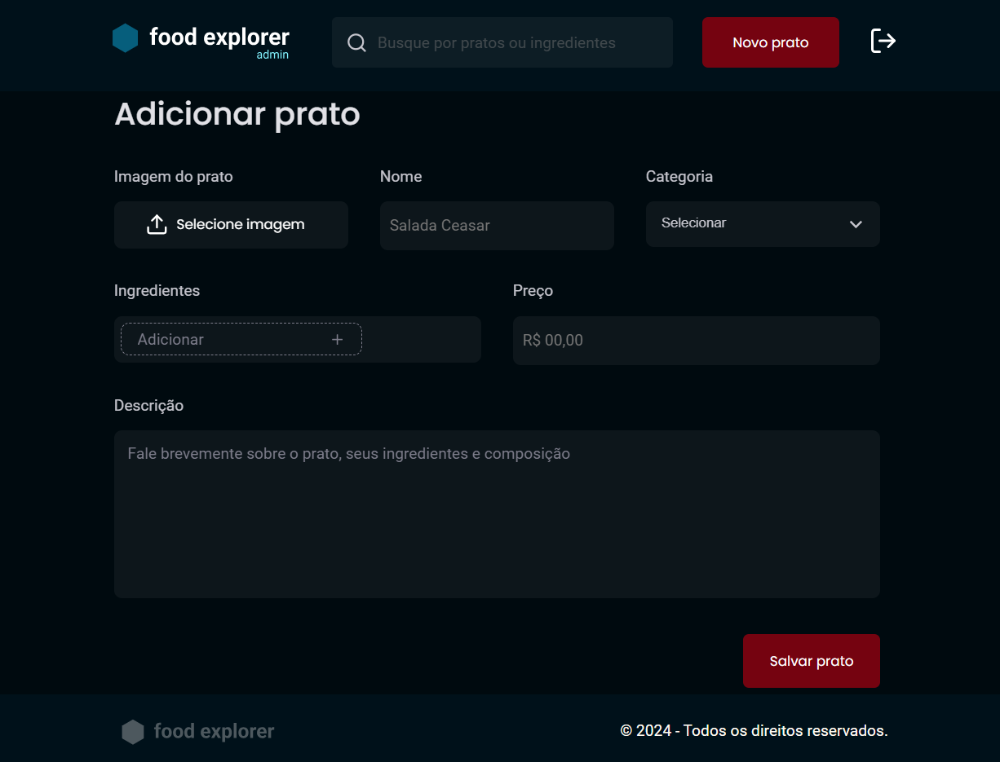
  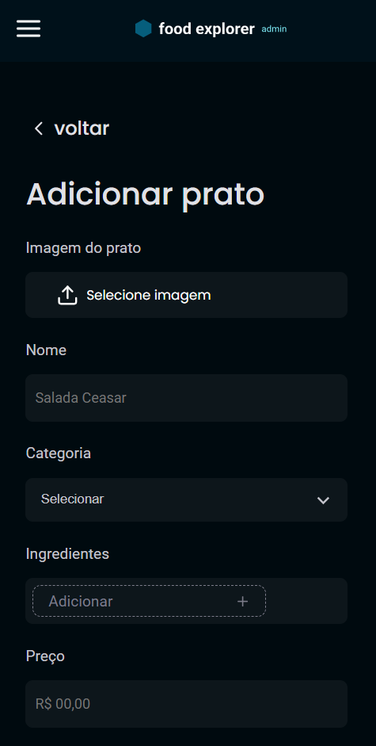
</p>

### 5. **Editar prato**: Página com formulário para editar pratos existentes

<p align="center">
  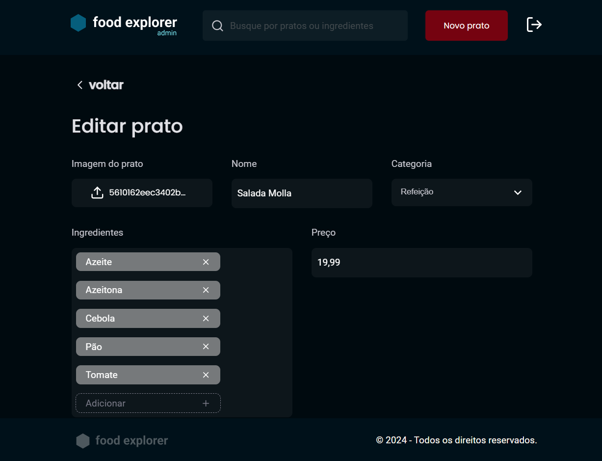
  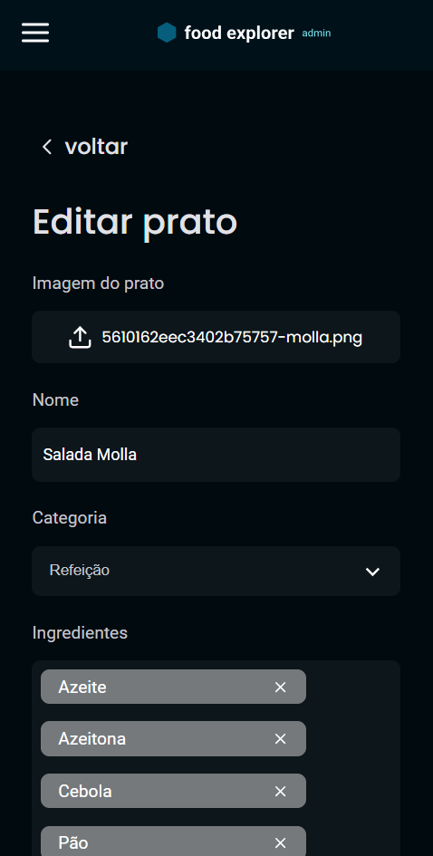
</p>

### 6. **Visualizar prato**: Detalhes de um prato específico

#### User

<p align="center">
  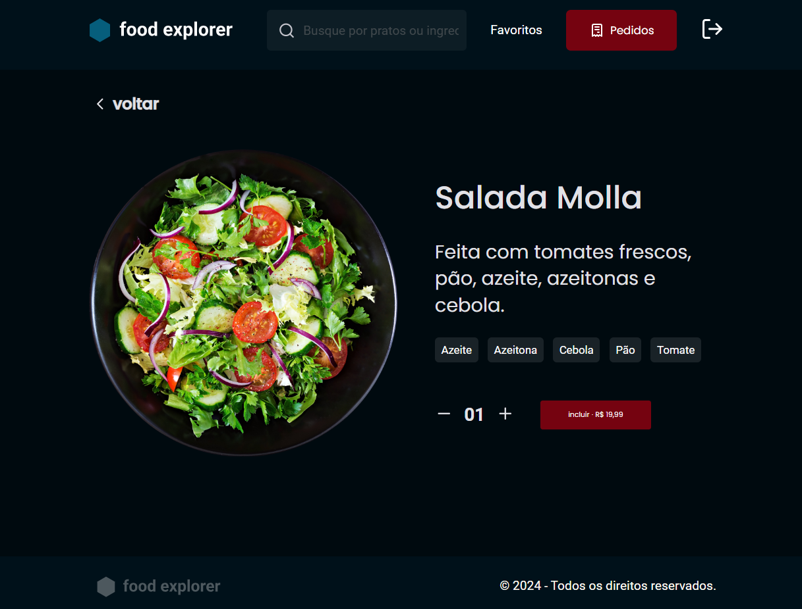
  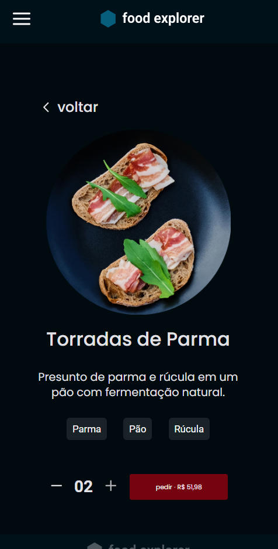
</p>

#### Admin

<p align="center">
  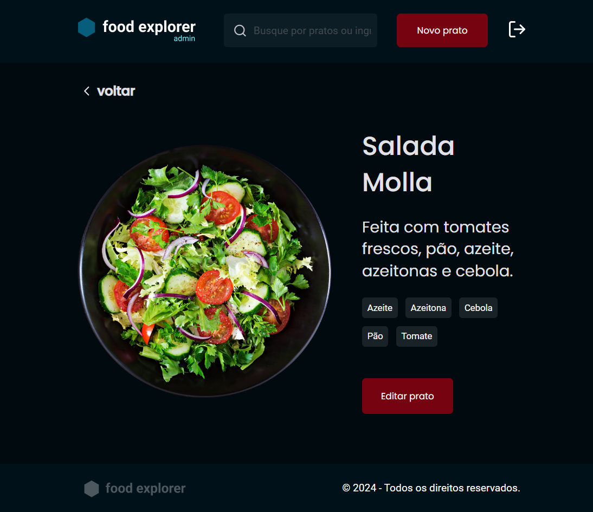
  
</p>

---

## ⚙️ Funcionalidades

- 🔑 **Login**: Iniciar sessão
- 📝 **Cadastro de usuário**: Criar uma conta de usuário
- 🍽️ **Cadastrar pratos**: Como administrador, cadastrar e criar novos pratos
- 🔍 **Filtrar pratos**: Filtrar pratos através da barra de pesquisa
- 🛠️ **Editar pratos**: Como administrador, editar pratos já cadastrados
- 🗑️ **Excluir pratos**: Como administrador, excluir pratos
- 🚪 **Logout**: Encerrar sessão do usuário

---

## 🛠️ Tecnologias

Este projeto foi desenvolvido com as seguintes tecnologias:

- **ViteJS**: Ferramenta de build e bundler super rápida
- **ReactJS**: Biblioteca para criação de interfaces
- **ReactDOM**: Ferramenta para integrar o React com o DOM
- **React Router Dom**: Navegação entre páginas da aplicação
- **react-responsive**: Biblioteca para criar layouts responsivos em React
- **Axios**: Cliente HTTP para interagir com APIs
- **Styled Components**: Biblioteca para estilos em componentes React
- **Swiper**: Biblioteca para criar sliders interativos

---

## 🚀 Para executar localmente

1. **Instale o Node.js** e o **npm** na sua máquina, se ainda não estiverem instalados.

2. **Clone este repositório**:
    ```bash
    git clone https://github.com/larissamateini/web-foodexplorer
    ```

3. **Instale as dependências**:
    ```bash
    npm install
    ```

4. **Inicie o servidor**:
    ```bash
    npm run dev
    ```

Agora, você pode acessar a aplicação em `http://localhost:5173`.

---

## 👥 Users para teste

1. **Admin**:  
   - **E-mail**: admin@test.com  
   - **Senha**: admin123  

2. **Usuário**:  
   - **E-mail**: user@test.com  
   - **Senha**: user123  

---

### 📜 Licença

Distribuído sob a licença MIT. Veja [LICENSE](LICENSE) para mais informações.
